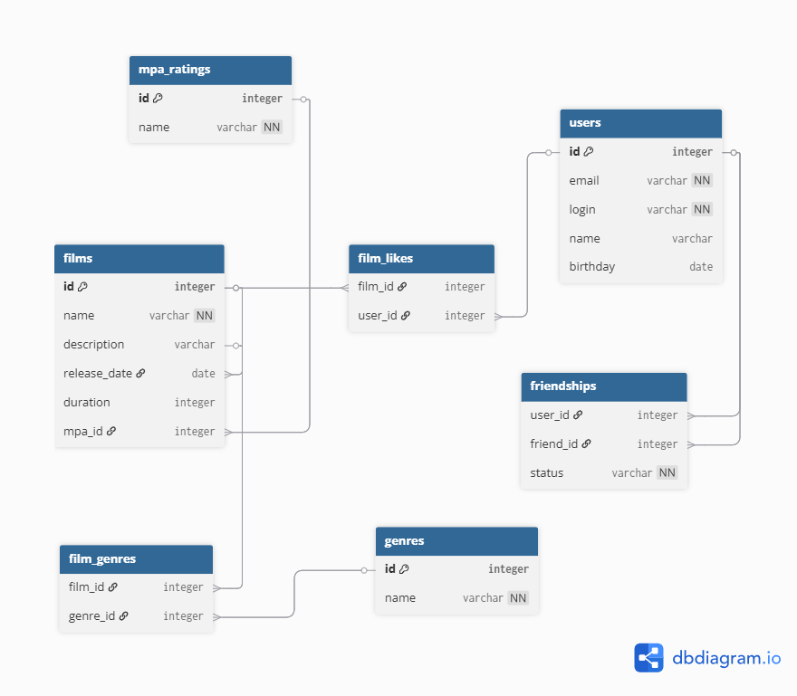

# Filmorate - Сервис для оценки фильмов

## Описание проекта

Filmorate - это веб-сервис для оценки фильмов, написания отзывов и создания рекомендаций. Пользователи могут добавлять фильмы в избранное, ставить лайки, писать отзывы и находить друзей с похожими вкусами.

## Технологии

- **Java**
- **Spring Boot**
- **Spring**
- **Spring JDBC**
- **H2 Database**
- **Lombok**
- **Maven**
- **REST API**

## Функциональность

### Управление пользователями
- ✅ Регистрация и обновление пользователей
- ✅ Добавление/удаление друзей
- ✅ Просмотр общих друзей
- ✅ Лента событий пользователя
- ✅ Удаление пользователей

### Управление фильмами
- ✅ Добавление и обновление фильмов
- ✅ Поиск фильмов по названию и режиссеру
- ✅ Получение популярных фильмов (с фильтрацией по жанру и году)
- ✅ Добавление/удаление лайков
- ✅ Получение общих фильмов с друзьями
- ✅ Удаление фильмов

### Система отзывов
- ✅ Создание, редактирование и удаление отзывов
- ✅ Лайки и дизлайки отзывов
- ✅ Просмотр отзывов по фильмам
- ✅ Рейтинг полезности отзывов

### Режиссеры
- ✅ CRUD операции для режиссеров
- ✅ Фильмы по режиссерам с сортировкой
- ✅ Связь фильмов с режиссерами

### Рекомендации
- ✅ Персональные рекомендации фильмов
- ✅ Поиск пользователей с похожими вкусами

### Жанры и MPA рейтинги
- ✅ Получение списка жанров
- ✅ Получение MPA рейтингов
- ✅ Привязка к фильмам

## API Endpoints

### Пользователи

## Схема базы данных




## Примеры SQL запросов

**Получить все фильмы:**

```sql
SELECT * 
FROM films;
```

**Получить всех пользователей:**

```sql
SELECT * 
FROM users;
```

**Получение жанров фильма**

```sql
SELECT g.genre_id, g.name
FROM genres g
JOIN film_genres fg ON g.genre_id = fg.genre_id
WHERE fg.film_id = 789
ORDER BY g.genre_id;
```

**Добавление лайка фильму**

```sql
INSERT INTO likes (film_id, user_id)
VALUES (789, 123);
```

**Получение топ-10 популярных фильмов**

```sql
SELECT f.film_id, f.name, f.description, f.release_date, f.duration,
       m.name as mpa_name, COUNT(l.user_id) as likes_count
FROM films f
JOIN mpa_ratings m ON f.mpa_id = m.mpa_id
LEFT JOIN likes l ON f.film_id = l.film_id
GROUP BY f.film_id, f.name, f.description, f.release_date, f.duration, m.name
ORDER BY likes_count DESC
LIMIT 10;
```

**Получение фильмов по жанру "Комедия"**

```sql
SELECT f.film_id, f.name, f.release_date, f.duration, m.name as mpa
FROM films f
JOIN film_genres fg ON f.film_id = fg.film_id
JOIN genres g ON fg.genre_id = g.genre_id
JOIN mpa_ratings m ON f.mpa_id = m.mpa_id
WHERE g.name = 'Комедия'
ORDER BY f.release_date DESC;
```

**Удаление друга**

```sql
DELETE FROM friends 
WHERE (user_id = 123 AND friend_id = 456)
OR (user_id = 456 AND friend_id = 123);
```
